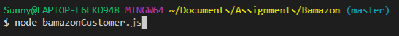
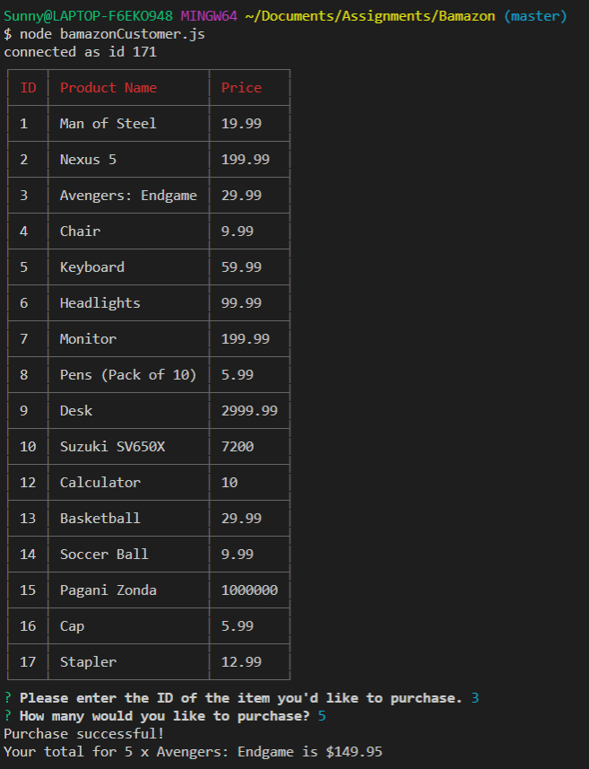

# Bamazon

## Amazon like CLI app

### Customer

Run **_node bamazonCustomer.js_** in terminal.

You will be shown a list of products available for sale.

Enter the **_ID_** of the product you would like to purchase.

Then enter the quantity you would like to order.

If quantity requested exceeds quantity on stock, you will be asked to retry.

### Manager

Run **_node bamazonManager.js_** in terminal.

You will then be prompted to pick one of the following options:

1. View Products for Sale
   Select this option to see a list of products available for sale.
   
2. View Low Inventory
   Select this to view which product has a stock quantity less than 5.
   
3. Select this to add stock to a product. You will be asked for an item ID and the amount to be added.
   
   Before:
   
   After:
   
4. Add New Product
   Select this to add a new product. You will be asked the product name, department name it belongs to, price, and quantity you have to sell.

   
   

5. Quit
   Select this to quit.
